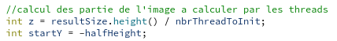

# PCO Labo 3
optimiser le calcul d'une courbe de Mandelbrot avec le multithres

## Résumé d'implémentation

Ici je vais vous décrire les étapes d'implémentation et la manière dont nous avons abordé le problème.

- Premièrement nous avons réfléchis à la manière de séparer notre "image" en partie.
  Nous avons choisis de séparer l'image en bloc selon la hauteur. Pour cela nous avons fait un calcul dans le fichier "renderthread.cpp".

