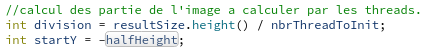

# PCO Labo 3
optimiser le calcul d'une courbe de Mandelbrot avec le multithres

## Résumé d'implémentation

Ici je vais vous décrire les étapes d'implémentation et la manière dont nous avons abordé le problème.

- Premièrement nous avons réfléchis à la manière de séparer notre "image" en partie.
  Nous avons choisis de séparer l'image en bloc selon la hauteur. Pour cela nous avons fait un calcul dans le fichier "renderthread.cpp".

Ici "z" correspond à la hauteur des sous-images. La première image va débuter à startY qui correspond au haut de l'image sachant que le centre de l'image est a 0.

- Ensuite nous avons créé une classe : ThreadCalcul. Cette classe hérite de Qthread et va nous permettre d'ordonner le calcul d'une partie de l'image à chaque thread créé selon les paramétres donnés.

- Les paramètre du constructeurs de ThreadCalcul sont fortement nombreux. Les paramètre utilisé en écriture dans le code et qui nécéssite d'être lus ailleur sont passé par pointeur.

- Ensuite nous avons récupéré une partie de la méthode de calcul de l'image se trouvant dans "renderthread" pour la mettre dans notre méthode run() qui est executée au lancement de nos threads personnels. Nous avons récupéré depuis la boucle for de traitement selon la hauteur de l'image jusqu'à la fin de celle-ci. (cf: voir code threadcalcul.cpp).

- peu de changement autres ont été effectués.

## Choix d'implémentation.

- Le choix de séparation en bloc selon les lignes a été un choix rapide pour nous. La raison est que le découpage de la méthode de calcul selon les lignes nous paraissait plus simple car elle correspond à la première boucle de calcul. Nous avions pensé a donner les calculs lignes par lignes au threads mais nous ne pensons pas que cela accélére le calcul et nous aurait surement compliqué l'implémentation.

- Le passage des paramètre via le constructeur pour la création de nos threads "ThreadCalcul" nous paraissait le plus simple. Il est peut-être possible d'avoir des méthode plus "propre" comme par exemple avec certains paramètres statics ou via des structures regroupant nos paramètre. Mais passer notre temps sur des choix esthétique était un priorité moindre fasse à l'efficacité de notre code.

## Difficulté rencontrées.

- Notre première difficulté a été de séparer correctement l'images avec les bon paramètre pour que nos threads se chevauchent pas. Cela a été résolus après un minimum de réfléxion.

- L'utilisation du langage C++ a aussi été une difficulté car cela fait longtemps que nous l'avons plus pratiqué et que nous avons souvent tendance à le confondre avec le Java.

- La correction finale du code qui donnait une "segmentation fault" qui a été corrigé avec l'aide du professeur via l'ajout de la création de l'image dans la boucle while dans le fichier "renderthread.cpp".

## Conclusion

Ce programme était en théorie simple, en pratique un peu moins même si il ne demandait pas une énorme réfléxion. C'était intéressant car cela nous a permit de nous remettre au c++ tranquilement ainsi que je jouer avec de jolis effets graphiques. Sans oublier le fait de pratiquer l'utilisation des Threads, de QT et ses opportunités de débug.
